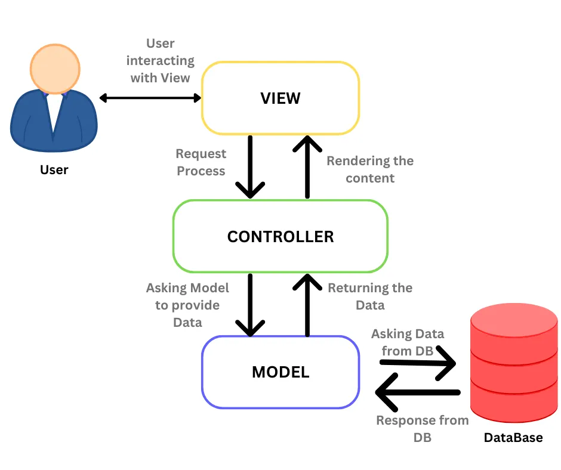

# Laporan Modul 1: Perkenalan Laravel
**Mata Kuliah:** Workshop Web Lanjut   
**Nama:** Nazril Kanahaya Akbar  
**NIM:** 2024573010105 
**Kelas:** TI-1B 

---

## Abstrak 
Laporan ini membahas pengenalan framework Laravel, salah satu framework PHP populer yang menggunakan arsitektur Model–View–Controller (MVC). Tujuan laporan adalah memahami konsep dasar Laravel, mengenali komponen utamanya, menjelaskan struktur project, serta meninjau kelebihan dan kekurangannya sebagai refleksi pembelajaran awal.

---

## 1. Pendahuluan
Laravel adalah framework PHP open-source yang dirancang untuk memudahkan pengembangan aplikasi web modern. Laravel bersifat **opinionated**, artinya ia menawarkan cara baku dalam membangun aplikasi agar lebih rapi dan konsisten.  
Karakteristik utamanya adalah penggunaan arsitektur **MVC (Model–View–Controller)**, sintaks yang elegan, serta ekosistem luas yang mendukung hampir semua kebutuhan aplikasi web.  
Laravel cocok digunakan untuk membangun berbagai jenis aplikasi, mulai dari website sederhana, aplikasi bisnis berskala besar, hingga layanan berbasis API.

---

## 2. Komponen Utama Laravel (ringkas)
- **Blade (Templating):** Mesin template bawaan Laravel yang memungkinkan kita menyusun tampilan dengan sintaks sederhana dan mendukung inheritance.  
- **Eloquent (ORM):** Fitur untuk berinteraksi dengan database menggunakan model berbasis objek tanpa harus menulis query SQL secara manual.  
- **Routing:** Sistem untuk menentukan URL dan menghubungkannya dengan controller atau aksi tertentu.  
- **Controllers:** Tempat logika bisnis aplikasi, menghubungkan antara model dan view.  
- **Migrations & Seeders:** Migrations mengelola struktur database dengan versioning, sedangkan seeders untuk mengisi data awal secara otomatis.  
- **Artisan CLI:** Command Line Interface bawaan Laravel yang menyediakan banyak perintah untuk mempercepat pengembangan.  
- **Testing (PHPUnit):** Mendukung pengujian otomatis agar kualitas kode tetap terjaga.  

---

## 3. Struktur Project Laravel
Secara umum, struktur project Laravel terdiri dari:
- **app/** → Berisi kode utama aplikasi, termasuk model, controller, middleware.  
- **bootstrap/** → File untuk bootstrap aplikasi dan mengatur autoloading.  
- **config/** → Berisi file konfigurasi untuk database, mail, cache, dsb.  
- **database/** → Berisi migrations, factories, seeders untuk pengelolaan database.  
- **public/** → Folder yang dapat diakses pengguna, berisi file `index.php`, CSS, JS, dan aset publik.  
- **resources/** → Tempat view (Blade templates), file bahasa, dan aset sebelum dikompilasi.  
- **routes/** → Menyimpan file routing (`web.php`, `api.php`, dsb.).  
- **storage/** → Berisi log, cache, session, dan file yang dihasilkan aplikasi.  
- **tests/** → Berisi kode pengujian otomatis.  
- **vendor/** → Folder yang berisi dependency dari Composer.  
- **.env** → File konfigurasi lingkungan (environment) seperti database, app key, dsb.  

---

## 4. Diagram MVC dan Cara Kerjanya

**Cara Kerja MVC di Laravel:**  
- **Model** menangani data dan interaksi dengan database.  
- **View** menampilkan data ke pengguna dalam bentuk antarmuka.  
- **Controller** menjadi penghubung antara model dan view, memproses permintaan dari user, mengambil data dari model, lalu mengirimkannya ke view.  

---

## 6. Kelebihan & Kekurangan (refleksi singkat)
**Kelebihan:**  
- Sintaks elegan dan mudah dipahami.  
- Ekosistem lengkap (Blade, Eloquent, Artisan, dsb.).  
- Dukungan komunitas luas dan dokumentasi resmi yang jelas.  
- Fitur keamanan bawaan seperti CSRF protection dan hashing.  

**Kekurangan / Tantangan Pemula:**  
- Cukup kompleks bagi yang baru belajar PHP.  
- Membutuhkan pemahaman dasar OOP, MVC, dan Composer sebelum nyaman digunakan.  
- Konsumsi resource bisa lebih besar dibanding framework sederhana.  

---

## 7. Referensi
- Laravel Official Documentation — https://laravel.com/docs  
- Artikel: “Apa itu Laravel dan Mengapa Populer?” — https://www.niagahoster.co.id/blog/laravel-adalah  
- Buku: *Laravel Up & Running* oleh Matt Stauffer — O’Reilly Media  
